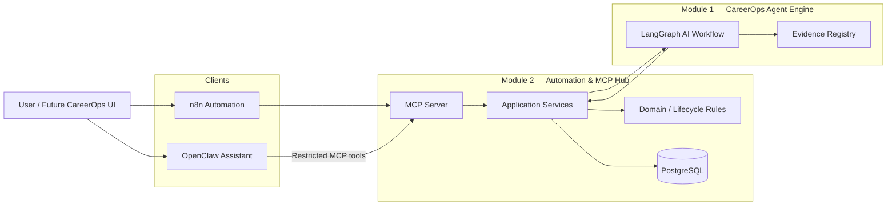

# CareerOps Automation & MCP Hub


[](https://github.com/ha7n23/careerops-automation-mcp-hub/actions/workflows/ci.yml)

**A secure automation and Model Context Protocol (MCP) integration layer for CareerOps, connecting deterministic n8n workflows and a conversational OpenClaw assistant to an evidence-grounded AI application engine.**

This repository is **Module 2 of the CareerOps platform**. It sits between user-facing automation clients and the CareerOps Agent Engine, providing durable application lifecycle management, MCP-native tools, human-in-the-loop review, failure reconciliation, and least-privilege AI assistant access.

> **Key idea:** AI can analyse, prepare and propose — but consequential career actions remain controlled, explicit and recoverable.

## What this project demonstrates

* **Model Context Protocol (MCP)** server design with typed business tools and resources
* **n8n workflow automation** for application preparation and human review
* **OpenClaw agent integration** as a conversational MCP client
* **Human-in-the-loop AI workflows** with explicit approval boundaries
* **Durable PostgreSQL state** rather than conversation state as the source of truth
* **Idempotency and reconciliation** for ambiguous or interrupted remote operations
* **Least-privilege tool exposure** for agent safety
* **Strict zero-spend OpenRouter policy** using explicit `:free` models only
* **Layered Python architecture**, FastAPI, SQLAlchemy, Alembic and async PostgreSQL
* Automated unit, integration, contract and policy testing

---

## Architecture



### Separation of responsibilities

**n8n** is the deterministic workflow client. It coordinates repeatable automation such as application preparation, reconciliation and review orchestration.

**OpenClaw** is the conversational client. It can understand a user's intent and operate CareerOps through a deliberately restricted MCP tool surface.

**The MCP Hub** owns application workflow coordination, durable state transitions, idempotency and integration with the Agent Engine.

**The Agent Engine** performs the evidence-grounded AI analysis and CV proposal workflow. It remains separate from the automation layer.

---

## Core application flow

```text
Saved application
       │
       ▼
Prepare application
       │
       ▼
Agent Engine analysis
       │
       ▼
Evidence-grounded CV proposals
       │
       ▼
Awaiting human review
       │
       ▼
Approve / Edit / Reject / Regenerate
       │
       ▼
Ready to apply
```

Preparing an application does **not** submit anything to an employer.

Likewise, approving CV proposals means approving the internal CareerOps review result — not authorising an external job application.

---

## MCP capabilities

The underlying CareerOps MCP server provides business-oriented tools for:

| Capability                  | Purpose                                           |
| --------------------------- | ------------------------------------------------- |
| `create_application`        | Create a saved internal CareerOps application     |
| `prepare_application`       | Run the Agent Engine preparation workflow         |
| `get_application_analysis`  | Recover durable AI analysis without restarting it |
| `review_application`        | Apply an explicit human review decision           |
| `get_application`           | Retrieve one application                          |
| `list_applications`         | Retrieve application state                        |
| `get_pending_actions`       | Surface actions requiring attention               |
| `update_application_status` | Perform valid internal lifecycle transitions      |

The server also exposes human-readable MCP resources for application and pending-action context.

### OpenClaw least-privilege surface

OpenClaw does **not** receive the complete MCP capability set.

Its policy exposes only:

```text
create_application
get_application
get_application_analysis
get_pending_actions
list_applications
prepare_application
review_application
```

`update_application_status` is deliberately excluded.

OpenClaw also uses the `minimal` built-in tool profile and receives no arbitrary shell, process, filesystem, web or direct database capability from this integration.

---

## Safe agent design

The OpenClaw integration is designed around **capability restriction rather than prompt instructions alone**.

### Durable state first

Conversation history is not authoritative business state.

Before consequential operations, the assistant can retrieve the latest durable CareerOps state through MCP.

### Explicit human review

CV proposal approval, rejection, editing and regeneration require an intentional review action.

Blocked proposals cannot simply be treated as approved proposals.

### No blind retries

Remote AI operations can have ambiguous outcomes.

CareerOps records durable preparation and review state before remote work is performed. If an outcome is uncertain, the system reconciles existing state instead of blindly repeating a consequential operation.

### No employer submission

Module 2 contains no employer-submission capability for OpenClaw.

The assistant can help move an application to an internally prepared state, but it cannot claim that an external employer application was submitted.

---

## Zero-spend OpenClaw model policy

The current OpenClaw configuration intentionally enforces a **$0 model-cost policy**.

Primary:

```text
openrouter/nvidia/nemotron-3.5-lightning:free
```

Fallback:

```text
openrouter/nvidia/nemotron-3-nano-omni-30b-a3b-reasoning:free
```

Only explicit `:free` model IDs are allowlisted.

The policy intentionally excludes:

```text
openrouter/auto
```

and does not configure a paid fallback.

If the free OpenRouter quota is exhausted, the assistant fails safely rather than silently routing to a paid model.

The non-secret policy is versioned in:

```text
openclaw/config/careerops.patch.json
```

and automated tests enforce the free-model and least-privilege invariants.

---

## n8n automation

Module 2 also provides reusable n8n workflows for deterministic orchestration.

### Application Preparation

Accepts a controlled preparation request, creates or identifies the application, invokes CareerOps preparation and handles durable outcomes.

### Preparation Reconciliation

Recovers preparation state when the initial outcome cannot safely be assumed.

The workflow avoids guessing or blindly repeating the business operation.

### Human Review

Processes explicit review decisions such as:

* approve
* edit
* reject
* regenerate

The workflow validates the expected proposal state before performing the review and uses stable idempotency controls.

---

## End-to-end integration

A real local E2E path has been exercised across the platform:

```text
OpenClaw
   ↓
CareerOps MCP
   ↓
Module 2 application services
   ↓
CareerOps Agent Engine
   ↓
LangGraph analysis
   ↓
Evidence-grounded CV proposals
   ↓
Human review
   ↓
Durable PostgreSQL state
```

The verified flow included:

* creating an application through OpenClaw
* retrieving durable application state
* preparing a real synthetic job description
* running the Module 1 AI analysis
* generating CV proposals
* surfacing a blocked proposal
* retrieving the latest analysis before review
* approving only the reviewable proposals
* excluding the blocked proposal
* reconciling final durable state
* reaching `ready_to_apply`

The final controlled review completed with the blocked proposal still excluded from the approved set.

---

## Tech stack

### Backend

* Python 3.12
* FastAPI
* Pydantic
* SQLAlchemy
* asyncpg
* PostgreSQL
* Alembic
* HTTPX

### Agent and automation

* Model Context Protocol (MCP)
* n8n
* OpenClaw
* OpenRouter

### Engineering quality

* pytest
* mypy
* Ruff
* Docker / Docker Compose
* Contract testing
* Idempotency controls
* Secrets auditing
* Environment-based configuration

---

## Repository structure

```text
careerops-automation-mcp-hub/
├── contract_tests/        # Agent Engine HTTP contract tests
├── migrations/            # Alembic database migrations
├── n8n/
│   ├── compose.yaml
│   └── workflows/         # Versioned CareerOps automation workflows
├── openclaw/
│   ├── config/            # Reproducible non-secret policy
│   ├── skills/careerops/  # CareerOps-specific agent skill
│   ├── .env.example
│   └── compose.yaml
├── scripts/               # Local servers and integration smoke tests
├── src/
│   └── careerops_automation_mcp_hub/
│       ├── api/
│       ├── application/
│       ├── core/
│       ├── domain/
│       ├── infrastructure/
│       └── mcp/
├── tests/
├── .env.example
└── pyproject.toml
```

The Python codebase follows layered boundaries between domain logic, application orchestration, infrastructure and external interfaces.

---

## Local development

### Prerequisites

* Python 3.12+
* `uv`
* Docker and Docker Compose
* PostgreSQL
* A running CareerOps Agent Engine for full cross-module integration

Clone the repository:

```bash
git clone https://github.com/ha7n23/careerops-automation-mcp-hub.git
cd careerops-automation-mcp-hub
```

Install dependencies:

```bash
uv sync
```

Create local configuration:

```bash
cp .env.example .env
```

Populate the required local environment values before starting integration services.

Never commit `.env` files or live credentials.

---

## Development MCP server

A local Streamable HTTP MCP server can be started with:

```bash
uv run --env-file .env python scripts/run_dev_mcp_server.py
```

Development principal values can be overridden through:

```text
CAREEROPS_DEV_MCP_USER_ID
CAREEROPS_DEV_MCP_ACTOR_ID
```

The defaults are development-only identities and are not intended as a production authentication mechanism.

---

## OpenClaw

Start the gateway:

```bash
docker compose -f openclaw/compose.yaml \
  up -d --wait openclaw-gateway
```

Validate the committed policy before applying it:

```bash
docker compose -f openclaw/compose.yaml \
  run -T --rm openclaw-cli \
  config patch \
  --stdin \
  --replace-path agents.defaults.models \
  --replace-path mcp.servers.careerops \
  --dry-run \
  --json \
  < openclaw/config/careerops.patch.json
```

Probe the CareerOps MCP integration:

```bash
docker compose -f openclaw/compose.yaml \
  run --rm openclaw-cli \
  mcp probe careerops --json
```

The expected OpenClaw surface is exactly seven CareerOps business tools.

---

## Quality gates

Run the repository checks with:

```bash
uv run ruff format --check .
uv run ruff check .
uv run mypy src
uv run pytest -q
```

The latest Module 2 validation passed:

```text
Ruff format       ✓
Ruff lint         ✓
mypy              ✓
pytest            199 passed
Compose validation ✓
OpenClaw secrets   clean
```

The OpenClaw policy also has dedicated automated tests covering:

* explicit `:free` model allowlisting
* no `openrouter/auto`
* exact primary and fallback models
* CareerOps-only skill selection
* minimal OpenClaw tool profile
* exact MCP tool allowlist
* exclusion of `update_application_status`
* expected timeout policy

---

## Relationship to CareerOps

CareerOps is being built as a modular AI engineering platform.

**Module 1 — Agent Engine**
Evidence-grounded job analysis, LangChain/LangGraph workflows, LangSmith observability and human-reviewed CV proposal generation.

**Module 2 — Automation & MCP Hub**
This repository. Durable application operations, MCP integration, n8n workflows and the OpenClaw conversational assistant.

**Module 3 — AI-Native Engineering Workbench**
Planned development and delivery layer covering reusable engineering agents/skills, testing, security, frontend/backend workflows and deployment automation.

The modules are separate engineering boundaries but are designed to operate together as one CareerOps platform.

---

## Current scope

This repository intentionally focuses on **safe internal career workflow orchestration**.

Not currently implemented here:

* automatic employer/job-portal submission
* unrestricted application status manipulation by the AI assistant
* arbitrary OpenClaw shell or filesystem access
* paid OpenRouter model fallback
* BYOK model configuration
* messaging-channel integrations
* production frontend integration

These boundaries are deliberate rather than missing shortcuts.

---

## License

MIT
