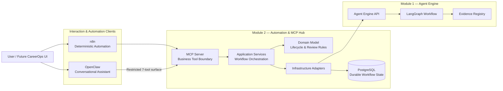
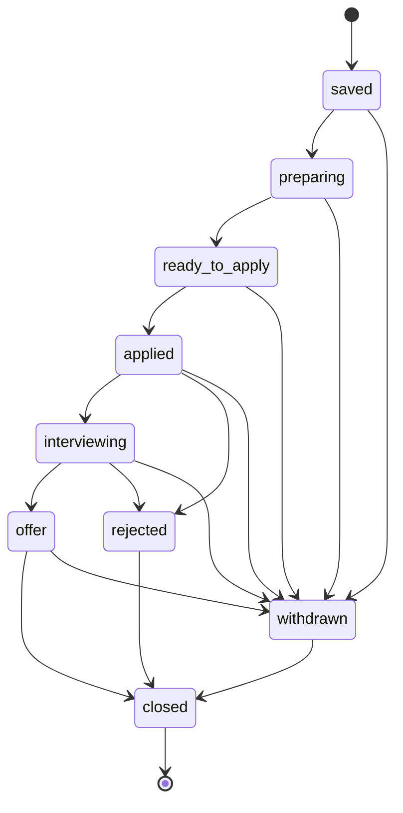
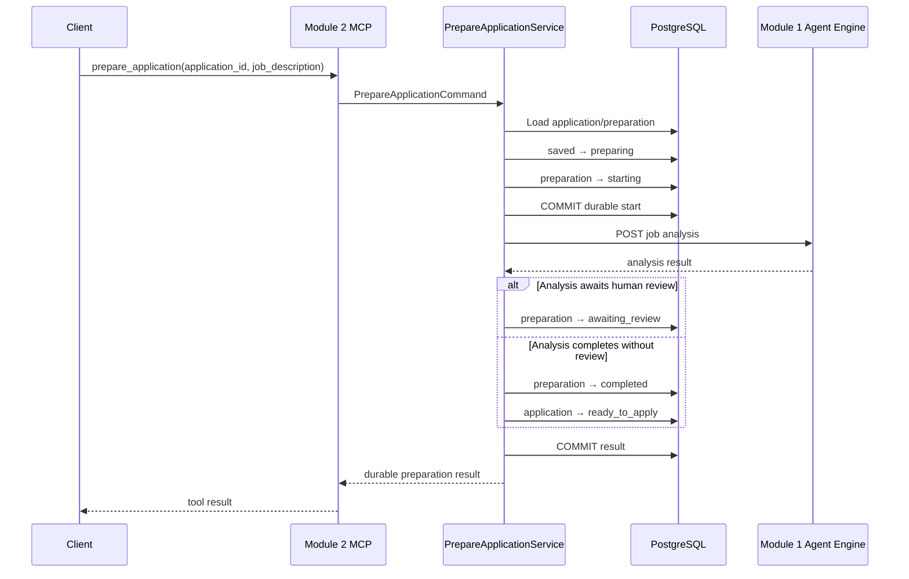
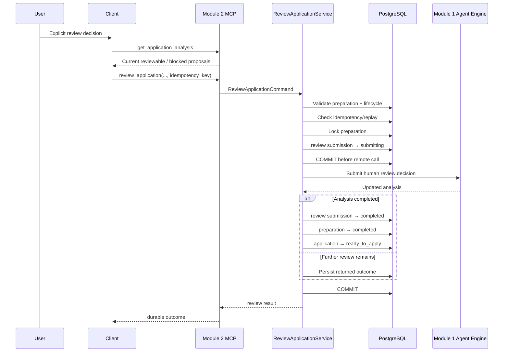
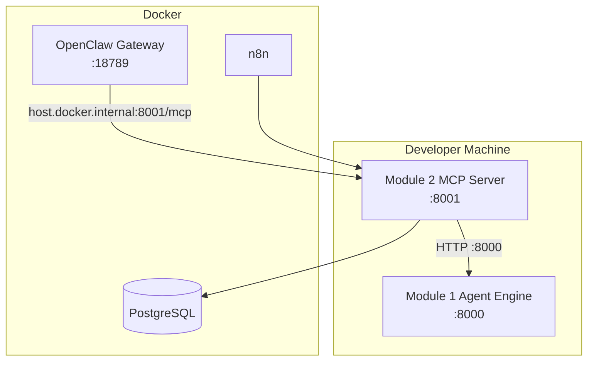
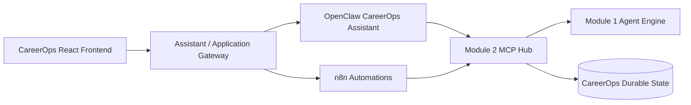

# CareerOps Automation & MCP Hub — Architecture

> **Module 2 of CareerOps** — a durable automation and Model Context Protocol (MCP) integration layer that connects deterministic n8n workflows and a constrained OpenClaw assistant to the CareerOps Agent Engine.

## Architecture summary

CareerOps Module 2 is designed around a simple principle:

**AI may analyse, propose and assist, but durable application state and consequential actions remain explicit, controlled and recoverable.**

The module sits between automation clients and the CareerOps Agent Engine. It exposes business capabilities through MCP, owns the application workflow state in PostgreSQL, coordinates long-running calls to Module 1, and protects human-review boundaries with idempotency, reconciliation and least-privilege tool access.

At a glance:



### What Module 2 owns

- internal job-application lifecycle state;
- preparation and review orchestration;
- durable records of in-flight and completed remote operations;
- MCP business tools and resources;
- n8n automation workflows;
- OpenClaw integration and least-privilege policy;
- idempotency and replay protection;
- failure classification and reconciliation;
- integration contracts with the CareerOps Agent Engine.

### What Module 2 deliberately does not own

- job-analysis reasoning or CV evidence generation — these belong to Module 1;
- employer/job-portal submission;
- unrestricted agent access to application lifecycle mutations;
- arbitrary shell, filesystem, process, web or database access for OpenClaw;
- the future end-user React interface;
- conversation memory as a source of authoritative business state.

---

## 1. Design goals

The architecture was shaped around six engineering goals.

### 1.1 Durable state over conversational state

Application status, preparation progress, review submissions and action history are persisted outside any LLM conversation. A client can disconnect, retry, or be replaced without losing the authoritative CareerOps workflow state.

### 1.2 Deterministic orchestration around probabilistic AI

Module 1 can contain LLM-backed analysis, but Module 2 treats it as an external service behind typed ports and explicit workflow transitions. Business state changes are deterministic even when the underlying AI work is not.

### 1.3 Human control over consequential review actions

CV proposal approval, rejection, editing and regeneration are represented as explicit review operations. Module 2 does not infer approval from model output or conversation context.

### 1.4 Safe failure and recovery

Long-running remote calls can fail after the downstream service has already done work. Module 2 therefore records operation state before crossing the network boundary and distinguishes known failure from ambiguous outcome.

### 1.5 Least privilege for agentic clients

OpenClaw receives only the capabilities required for the conversational CareerOps assistant. Its accessible MCP tool set is narrower than the full Module 2 MCP server.

### 1.6 Replaceable clients and infrastructure

n8n and OpenClaw are clients of the same business boundary rather than owners of CareerOps logic. The same application services can therefore support future interfaces without duplicating domain rules.

---

## 2. System boundaries

CareerOps is intentionally split into separate modules with clear responsibilities.

| Boundary | Responsibility |
|---|---|
| **Module 1 — Agent Engine** | Evidence-grounded job analysis, requirement extraction, fit assessment, CV proposal generation, proposal verification and human-review continuation through LangGraph. |
| **Module 2 — Automation & MCP Hub** | Application workflow state, MCP capabilities, n8n automation, OpenClaw integration, idempotency, reconciliation and cross-module orchestration. |
| **Module 3 — AI-Native Engineering Workbench** | Planned engineering/development workflow layer covering reusable skills/agents, testing, security, frontend/backend delivery and deployment automation. |

Module 2 communicates with Module 1 through an HTTP adapter rather than importing Agent Engine business logic directly. This preserves an explicit service boundary and keeps the two repositories independently testable.

---

## 3. Internal layered architecture

The Python package is organised around domain/application/infrastructure boundaries rather than around external frameworks.

```text
src/careerops_automation_mcp_hub/
├── api/              # HTTP-facing application endpoints
├── application/      # Use cases, ports, orchestration and errors
├── core/             # Configuration and shared runtime concerns
├── domain/           # Lifecycle, entities and business rules
├── infrastructure/   # PostgreSQL and Agent Engine adapters
└── mcp/              # MCP schemas, principals and server surface
```

### Domain layer

The domain layer contains the business concepts that should remain valid regardless of MCP, n8n, OpenClaw, FastAPI or PostgreSQL.

Examples include:

- `JobApplication`;
- application lifecycle transitions;
- preparation state;
- review submissions and outcomes;
- application events;
- pending actions.

### Application layer

The application layer coordinates use cases such as:

- creating an application;
- preparing an application;
- retrieving analysis;
- reviewing proposals;
- listing applications;
- updating valid internal status;
- retrieving pending actions.

It depends on ports rather than concrete infrastructure implementations.

### Infrastructure layer

Infrastructure adapters implement external dependencies, including:

- PostgreSQL persistence;
- SQLAlchemy repositories and unit-of-work boundaries;
- the HTTP client for Module 1;
- runtime integration concerns.

### Interface layer

MCP and HTTP interfaces translate transport-level input into application commands/queries. They do not own the underlying domain rules.

---

## 4. Application lifecycle

Module 2 defines an explicit internal lifecycle rather than allowing arbitrary status strings.



Invalid transitions are rejected by the domain model rather than left to the discretion of an automation client or LLM.

This lifecycle is broader than the OpenClaw capability set. For example, the full MCP server exposes an internal `update_application_status` tool, but OpenClaw is deliberately denied that capability.

---

## 5. MCP server as the business capability boundary

The MCP server exposes application-oriented capabilities rather than low-level database or filesystem operations.

### Full Module 2 MCP tool surface

| Tool | Mutation | Purpose |
|---|---:|---|
| `create_application` | Yes | Create an internal saved application using an idempotency key. |
| `prepare_application` | Yes | Coordinate job analysis and CV proposal generation through Module 1. |
| `get_application_analysis` | No | Recover the current durable Agent Engine analysis without starting or retrying work. |
| `review_application` | Yes | Apply an explicit human review decision using an idempotency key. |
| `get_application` | No | Retrieve one application. |
| `update_application_status` | Yes | Move an application through a valid internal lifecycle transition. |
| `list_applications` | No | List applications, optionally by status. |
| `get_pending_actions` | No | Retrieve workflow actions requiring user attention. |

The server additionally provides human-readable MCP resources for individual application state and pending actions.

### Why business tools instead of generic tools?

A generic SQL, shell or HTTP tool would force each client to understand and reproduce CareerOps business rules. The MCP layer instead presents bounded operations with typed parameters and domain-aware behaviour.

That gives the system:

- one source of lifecycle rules;
- reusable capabilities across clients;
- safer agentic access;
- clearer auditability;
- better contract testing.

---

## 6. Two clients, two different roles

Module 2 intentionally supports both deterministic and conversational automation without making them compete for ownership of the workflow.

### n8n — deterministic orchestration

n8n is used for repeatable process automation where the sequence should be explicit and inspectable.

The versioned workflows cover the main operational paths for:

- application preparation;
- preparation reconciliation;
- human review.

n8n remains useful when a workflow should follow a known route, integrate with future triggers/schedules, or expose each transition visually.

### OpenClaw — conversational orchestration

OpenClaw acts as a conversational MCP client. It translates natural-language user intent into approved CareerOps operations.

It does **not** replace n8n and does **not** contain a second copy of CareerOps business logic.

Its role is:

```text
natural-language intent
        ↓
recover current durable state
        ↓
select an approved CareerOps MCP capability
        ↓
perform only the requested operation
        ↓
reconcile durable state
        ↓
report the result to the user
```

This separation allows the future CareerOps frontend to use conversational and deterministic automation side by side.

---

## 7. OpenClaw least-privilege design

The full MCP server exposes eight tools. OpenClaw receives exactly seven:

```text
create_application
get_application
get_application_analysis
get_pending_actions
list_applications
prepare_application
review_application
```

The excluded tool is:

```text
update_application_status
```

This is deliberate. The conversational assistant does not need a general-purpose lifecycle mutation capability to perform its current role.

### Effective OpenClaw policy

The committed non-secret policy configures:

- OpenClaw's `minimal` built-in tool profile;
- only `careerops__*` as additional tools;
- only the `careerops` workspace skill;
- a filtered Streamable HTTP MCP server;
- a 660-second MCP request timeout;
- an explicit free-model allowlist.

No CareerOps requirement depends on arbitrary shell, filesystem, process, web, media, direct PostgreSQL or direct Module 1 access from the assistant.

### CareerOps skill

The custom `SKILL.md` reinforces the capability boundary with operating rules including:

- durable state is authoritative;
- read before consequential review;
- use fresh idempotency keys for intentional mutation rounds;
- never blindly retry an ambiguous remote operation;
- never invent CV evidence or experience;
- never present blocked proposals as safely approvable;
- never claim employer submission without a specific capability and durable proof.

The prompt-level skill is defence in depth. The stronger control is the tool surface itself: unavailable capabilities cannot be invoked by the model.

---

## 8. Strict zero-spend model policy

The current OpenClaw integration intentionally runs with a strict **$0 OpenRouter constraint**.

Primary model:

```text
openrouter/nvidia/nemotron-3.5-lightning:free
```

Fallback:

```text
openrouter/nvidia/nemotron-3-nano-omni-30b-a3b-reasoning:free
```

The model catalog contains only those explicit `:free` IDs.

The policy deliberately excludes automatic routing such as:

```text
openrouter/auto
```

This means free-quota exhaustion causes a visible failure rather than an implicit paid fallback. The behaviour was observed during E2E testing when both approved free models reached the provider's free request limit and OpenClaw stopped instead of routing elsewhere.

The non-secret policy is versioned at:

```text
openclaw/config/careerops.patch.json
```

Dedicated tests verify the approved models and least-privilege MCP configuration.

---

## 9. Durable preparation orchestration

Application preparation crosses a distributed-systems boundary: Module 2 must persist its intent before asking Module 1 to perform potentially long-running AI work.

### Preparation sequence



### Why commit before Module 1?

Consider this failure:

1. Module 2 sends the request.
2. Module 1 completes the analysis.
3. The connection drops before Module 2 receives the response.

If no durable preparation record existed, a client might simply call `prepare_application` again and create duplicate work.

Instead, Module 2 persists the preparation as `starting` before the remote call. A subsequent request can observe existing non-pending state and avoid automatically starting a second analysis.

---

## 10. Failure classification and reconciliation

Not every remote failure means the same thing.

Module 2 distinguishes between:

### Known failure

The system has enough information to record that the operation failed, for example a clearly returned validation/authentication/request error.

### Unknown outcome

The caller cannot safely determine whether Module 1 processed the operation before the connection failed.

In this case the state is recorded as ambiguous rather than guessed.

### Read-only reconciliation

`get_application_analysis` exists specifically as a safe recovery primitive. It retrieves the current durable Agent Engine analysis without starting, retrying or resuming the workflow.

The recovery principle is:

```text
ambiguous mutation result
        ↓
DO NOT blindly repeat mutation
        ↓
read durable application/preparation state
        ↓
recover durable Agent Engine analysis
        ↓
decide next action from evidence
```

This behaviour is shared conceptually across the n8n and OpenClaw clients.

---

## 11. Human-in-the-loop review

When Module 1 returns an analysis requiring review, Module 2 records the preparation as `awaiting_review` and keeps the application in `preparing` until a valid review completes.

The user can then make an explicit decision through the review capability.

Review actions support approval, rejection, editing and regeneration according to the Agent Engine review contract.

### Review sequence



### Concurrency and replay protection

The review path checks existing submissions by idempotency key and locks the preparation row before creating a new unresolved review submission.

This protects against:

- duplicate client retries;
- concurrent review attempts;
- accidental resubmission after an ambiguous outcome;
- reuse of an idempotency key with a conflicting decision.

---

## 12. Blocked proposals and evidence safety

The Agent Engine can distinguish proposals that are reviewable from proposals that are blocked or unsupported.

Module 2 preserves those distinctions for clients rather than flattening the AI result into a single "approve everything" action.

The OpenClaw skill additionally requires the assistant to:

- retrieve the current analysis before review;
- operate only on current proposal IDs;
- exclude blocked proposals from approval;
- surface relevant warnings;
- avoid inventing evidence, employment history, qualifications or metrics.

During the cross-module E2E test, the analysis returned four CV proposals, one of which was blocked. The subsequent OpenClaw review approved only the three reviewable proposals, left the blocked proposal excluded, and moved the durable application to `ready_to_apply` after Module 1 returned a completed review result.

---

## 13. Idempotency model

Idempotency is used where a user or automation client may legitimately repeat a network request without intending to create a second business operation.

### Application creation

`create_application` requires an idempotency key so an accidental retry does not create duplicate saved applications.

### Human review

`review_application` requires a fresh idempotency key for each intentional review round.

The service can replay the same accepted operation while detecting conflicting reuse of the key.

### Preparation

Preparation is protected through durable operation state rather than a caller-provided idempotency key. Once a preparation has moved out of its initial pending state, the service does not blindly initiate another Agent Engine analysis for the same preparation.

---

## 14. Persistence and unit-of-work boundaries

PostgreSQL is the source of truth for Module 2 workflow state.

The application services operate through repository ports and an application unit-of-work abstraction. This allows each important business transition to define an explicit transactional boundary.

Important persisted concepts include:

- applications;
- preparation state;
- review submissions;
- application events;
- pending actions;
- idempotency-related state.

The architecture intentionally does not use OpenClaw conversations, n8n execution history or in-memory Python objects as the authoritative record of an application workflow.

---

## 15. Agent Engine integration

Module 2 treats Module 1 as an external service behind an `AgentEngineClient` port.

The HTTP adapter is responsible for transport concerns such as:

- base URL configuration;
- service/user headers;
- connection/read/write/pool timeouts;
- response validation;
- transport-to-application error mapping.

The application services remain written against the port rather than `httpx` directly.

### Timeout hierarchy

The current local integration allows Module 2 to wait up to 600 seconds for a long-running Agent Engine read operation. OpenClaw's outer MCP request timeout is configured to 660 seconds so the outer client does not abandon a request before Module 2's downstream contract can resolve.

```text
Module 1 analysis
      ↓
Module 2 Agent Engine read timeout: 600s
      ↓
OpenClaw MCP request timeout: 660s
```

This hierarchy was required in practice: a full preparation E2E run with the free-model stack took roughly 390 seconds.

The timeout is therefore a deliberate integration contract, not an assumption that AI analysis is instantaneous.

---

## 16. Principal and actor boundaries

MCP operations resolve a CareerOps principal containing the user and actor identity used by the application services.

For local development, the Streamable HTTP MCP server supports environment-configurable development identities:

```text
CAREEROPS_DEV_MCP_USER_ID
CAREEROPS_DEV_MCP_ACTOR_ID
```

This makes local n8n/OpenClaw testing explicit without hard-coding a single client identity into the server script.

The development identity mechanism is not presented as production authentication. The MCP server construction supports authentication/token-verifier integration points, while production identity and authorization remain a deployment concern for the wider CareerOps platform.

---

## 17. Security model

Security is applied in layers rather than delegated entirely to prompt instructions.

### Capability security

- OpenClaw receives only seven approved MCP tools.
- General lifecycle mutation is excluded from its surface.
- No employer-submission tool exists in the current assistant integration.
- OpenClaw uses the `minimal` built-in tool profile.
- Arbitrary shell/process/filesystem/web capabilities are not required for CareerOps operations.

### Business-rule security

- lifecycle transitions are domain validated;
- review requires valid preparation state;
- unresolved reviews block new consequential review submissions;
- idempotency keys protect creation/review retries;
- blocked proposals remain distinguishable from reviewable proposals.

### Distributed-systems safety

- preparation state is committed before Module 1 analysis;
- review submission state is committed before Module 1 review continuation;
- unknown outcomes are recorded rather than guessed;
- read-only reconciliation is available.

### Secrets and configuration

- live `.env` files are not committed;
- OpenClaw runtime authentication/session state remains outside Git;
- only the non-secret policy patch is versioned;
- the OpenClaw secrets audit is part of the validation process.

### Model-cost safety

- only explicit OpenRouter `:free` models are allowlisted;
- no paid fallback is configured;
- no automatic paid routing is allowed in the current policy.

---

## 18. Runtime topology

A representative local development topology is:



The exact production deployment topology may change later, but the software boundaries are designed so the clients, database and Agent Engine can be deployed independently.

---

## 19. Testing strategy

The repository tests behaviour at several levels.

### Unit tests

Exercise domain rules and application services without requiring the complete external stack.

### Integration/persistence tests

Validate repository and database behaviour around the durable workflow model.

### Agent Engine contract tests

Protect the HTTP boundary between Module 2 and Module 1 so request/response expectations do not silently drift.

### MCP tests

Validate the business-tool surface and its mapping to application use cases.

### OpenClaw policy tests

The committed policy has dedicated tests that assert:

- the primary and fallback model IDs are explicit `:free` models;
- the approved model catalog contains no `openrouter/auto`;
- only the CareerOps skill is selected;
- the tool profile remains `minimal`;
- the MCP server exposes the exact approved seven-tool OpenClaw subset;
- `update_application_status` remains excluded;
- the expected timeout policy remains intact.

At the final OpenClaw hardening checkpoint, the repository passed:

```text
Ruff format       ✓
Ruff lint         ✓
mypy              ✓
pytest             199 passed
Compose validation ✓
OpenClaw secrets   clean
```

---

## 20. Cross-module E2E evidence

The integration was exercised through the real local stack rather than only through mocked tests.

A representative OpenClaw path demonstrated:

1. OpenClaw connected to Module 2 over Streamable HTTP MCP.
2. Only the approved seven namespaced tools were available.
3. A synthetic application was created and re-read from durable state.
4. OpenClaw prepared the application exactly once using a supplied job description.
5. Module 2 persisted preparation state and called the real Module 1 Agent Engine.
6. Module 1 completed the LangGraph analysis and returned a 100 fit score with four CV proposals.
7. One proposal was reported as blocked.
8. OpenClaw re-read the current analysis before performing review.
9. The user explicitly approved the three reviewable proposal IDs.
10. `review_application` was invoked exactly once with a fresh idempotency key.
11. The blocked proposal was excluded from the approval set.
12. Module 1 completed the review continuation.
13. Module 2 reconciled the application to `ready_to_apply` and the analysis to an approved/completed state.

This validates the intended chain:

```text
OpenClaw
   ↓
Module 2 MCP boundary
   ↓
Application orchestration
   ↓
PostgreSQL durable state
   ↓
Module 1 Agent Engine
   ↓
LangGraph / Evidence Registry
   ↓
Human review
   ↓
Durable ready-to-apply result
```

A later conversational negative test is useful as an additional demonstration, but the architectural safety boundary does not depend on model compliance: OpenClaw has no general status-mutation tool and no employer-submission capability to invoke.

---

## 21. Key architectural decisions and trade-offs

### Synchronous Module 1 analysis

Current preparation waits for the Agent Engine request to resolve. This keeps the workflow simple and deterministic, but free-model analysis can be slow.

The architecture compensates through explicit timeouts and durable pre-call state. A later production version could introduce asynchronous job execution without changing the core business boundary.

### One OpenClaw CareerOps agent

Module 2 uses one constrained CareerOps assistant rather than creating a multi-agent system for its own sake.

This reduces orchestration complexity and keeps business capabilities centralised in MCP.

### PostgreSQL instead of assistant memory

Persisting workflow state increases implementation effort compared with relying on chat history, but it provides restart safety, client independence, traceable transitions and reliable reconciliation.

### Separate n8n and OpenClaw clients

Maintaining both adds integration surface, but each solves a different problem well: n8n for deterministic automation and OpenClaw for conversational intent handling.

### Capability restriction over prompt-only safety

A broader tool surface would make demonstrations easier, but withholding unnecessary capabilities provides a stronger and more defensible safety model.

---

## 22. Future platform integration

The intended future CareerOps interaction path is:



Potential later extensions include:

- authenticated frontend integration;
- richer notification/scheduling triggers through n8n;
- approved model selection and BYOK support;
- asynchronous long-running Agent Engine jobs;
- employer/job-portal submission as a **separate explicitly authorised capability** with confirmation and audit controls;
- deployment hardening and cloud infrastructure;
- Module 3 AI-native engineering workflows.

These are extension points, not prerequisites for the current Module 2 architecture.

---

## 23. Architectural takeaway

Module 2 is intentionally more than an MCP wrapper around an AI API.

Its main engineering contribution is the control plane around AI-assisted career workflows:

- typed business capabilities instead of generic agent powers;
- durable PostgreSQL state instead of chat memory;
- deterministic lifecycle rules around probabilistic AI;
- human approval for CV review decisions;
- idempotency and replay protection;
- explicit handling of unknown distributed outcomes;
- read-only reconciliation rather than blind retry;
- deterministic n8n automation and conversational OpenClaw access over the same application boundary;
- least-privilege agent tooling and an enforced zero-spend model policy.

That separation allows CareerOps to become more agentic over time without making the underlying business workflow less controlled.
